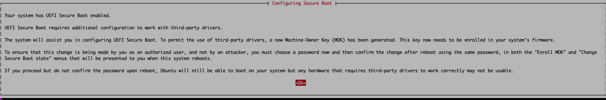

# Kamiwaza Installation Guide on Ubuntu 22.04LTS

This document outlines the steps to install Kamiwaza on a vanilla Ubuntu 22.04LTS server. The instructions are tested against a fresh Azure Ubuntu 22.04LTS Server (not Minimal) instance, and are intended to be executed on a fresh system.

## Discord

This thread originated from our discord on our #community-edition-support channel. Join us to discuss, ask questions, get help: <https://discord.gg/cVGBS5rD2U>

## Pre-requisites

- Ubuntu 22.04LTS Server image
- sudo privileges

## Installation Steps

### System Update and Python Installation

1. Update and upgrade the system packages:

    ```bash
    sudo apt update
    sudo apt upgrade
    ```

2. Install Python 3.10 and necessary libraries:

    ```bash
    sudo apt install -y python3.10 python3.10-dev libpython3.10-dev python3.10-venv golang-cfssl python-is-python3 etcd-client net-tools jq
    ```

### Node.js and NVM

1. Install NVM and Node.js:

    ```bash
    curl -o- https://raw.githubusercontent.com/nvm-sh/nvm/v0.40.1/install.sh | bash
    export NVM_DIR="$([ -z "${XDG_CONFIG_HOME-}" ] && printf %s "${HOME}/.nvm" || printf %s "${XDG_CONFIG_HOME}/nvm")"
    [ -s "$NVM_DIR/nvm.sh" ] && \. "$NVM_DIR/nvm.sh" # This loads nvm
    nvm install 21
    ```

### Docker and Docker Compose

1. Install Docker and Docker Compose:

    ```bash
    sudo apt install -y apt-transport-https ca-certificates curl software-properties-common
    curl -fsSL https://download.docker.com/linux/ubuntu/gpg | sudo gpg --dearmor -o /usr/share/keyrings/docker-archive-keyring.gpg
    echo "deb [arch=$(dpkg --print-architecture) signed-by=/usr/share/keyrings/docker-archive-keyring.gpg] https://download.docker.com/linux/ubuntu $(lsb_release -cs) stable" | sudo tee /etc/apt/sources.list.d/docker.list > /dev/null
    sudo apt update
    sudo apt install -y docker-ce docker-ce-cli containerd.io
    sudo curl -L "https://github.com/docker/compose/releases/download/v2.24.6/docker-compose-$(uname -s)-$(uname -m)" -o /usr/local/bin/docker-compose
    sudo chmod +x /usr/local/bin/docker-compose
    ```

### Additional Dependencies

1. Install CockroachDB and other dependencies:

    ```bash
    wget -qO- https://binaries.cockroachdb.com/cockroach-v23.1.17.linux-amd64.tgz | tar xvz
    sudo cp cockroach-v23.1.17.linux-amd64/cockroach /usr/local/bin
    sudo apt install -y libcairo2-dev libgirepository1.0-dev
    ```

### NVIDIA Drivers and Docker Configuration

1. Install NVIDIA drivers and configure Docker to use NVIDIA GPUs:

    ```bash
    sudo apt install -y nvidia-driver-550-server
    sudo reboot
    ```

    After reboot, enroll MOK if secure boot is enabled. In azure you would see something like:

    

2. Add the NVIDIA Docker repository and install the NVIDIA container toolkit:

    ```bash
    curl -fsSL https://nvidia.github.io/libnvidia-container/gpgkey | sudo gpg --dearmor -o /usr/share/keyrings/nvidia-container-toolkit-keyring.gpg \
    && curl -s -L https://nvidia.github.io/libnvidia-container/stable/deb/nvidia-container-toolkit.list | \
    sed 's#deb https://#deb [signed-by=/usr/share/keyrings/nvidia-container-toolkit-keyring.gpg] https://#g' | \
    sudo tee /etc/apt/sources.list.d/nvidia-container-toolkit.list
    sudo apt update
    sudo apt-get install -y nvidia-container-toolkit
    sudo apt install -y nvidia-docker2
    sudo systemctl restart docker
    sudo usermod -aG docker $USER
    ```

    Log out and back in for the group change to take effect.

### Test NVIDIA and Docker Installation

1. Test NVIDIA driver and Docker integration:

    ```bash
    docker run --rm --gpus all nvidia/cuda:12.4.1-runtime-ubuntu22.04 nvidia-smi
    ```

### Kamiwaza Installation

1. Download and install Kamiwaza:

    ```bash
    mkdir kamiwaza
    cd kamiwaza
    wget <kamiwaza package>
    tar -xvf kamiwaza-community-0.3.3-UbuntuLinux.tar.gz
    bash install.sh --community
    ```

    This script will automatically set up a virtual environment, install the necessary packages, and perform initial configuration.

## Post-Installation Steps

### Starting Kamiwaza Services

As of 0.3.2:

```bash
bash startup/kamiwazad.sh start
```


## Troubleshooting

- For issues related to secure boot and MOK enrollment, refer to the system documentation for guidance.
- Mentioned in the doc, but remember to log out/in after adding to the docker group

## Additional Notes

- This guide assumes a clean installation of Ubuntu 22.04LTS and administrative (sudo) privileges.
- Always verify the compatibility of drivers and software versions with your hardware and operating system.
- The installation steps and scripts provided by Kamiwaza are designed to streamline the setup process but always review each command for your specific environment.
