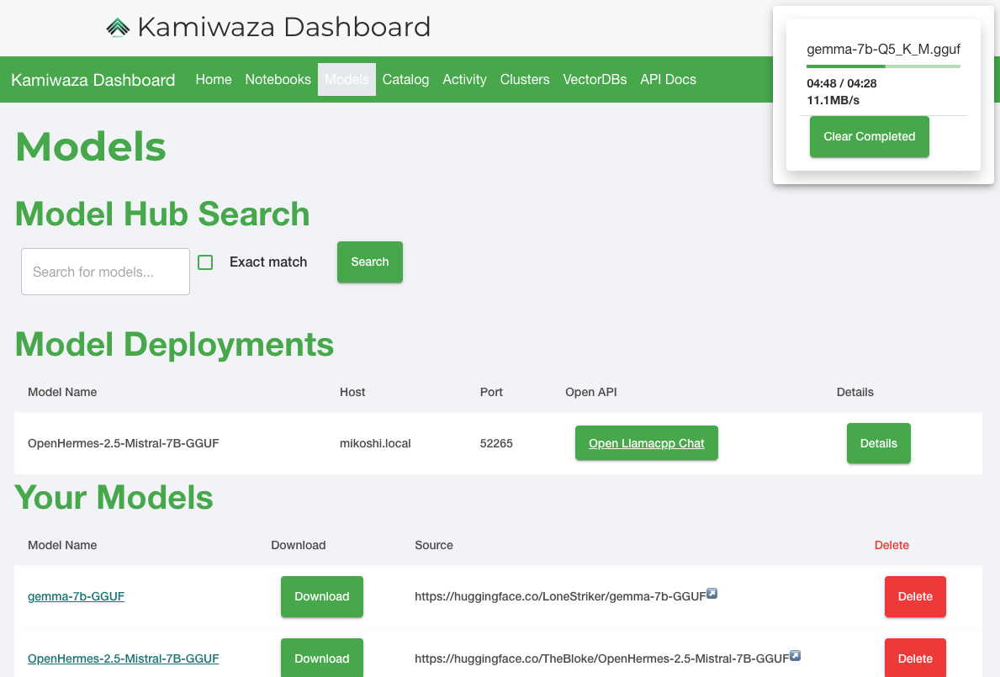
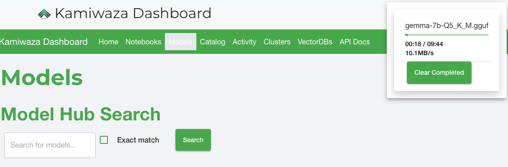
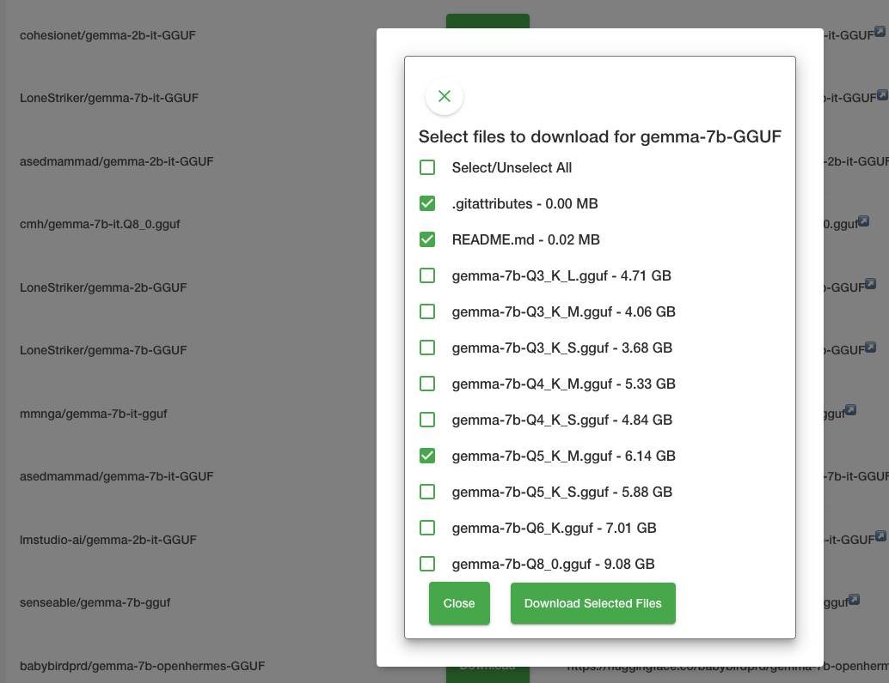
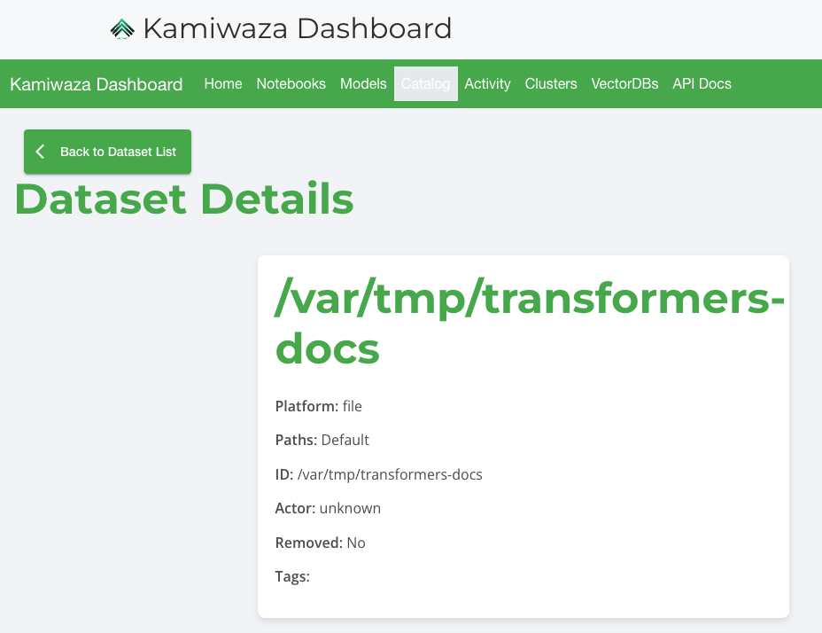
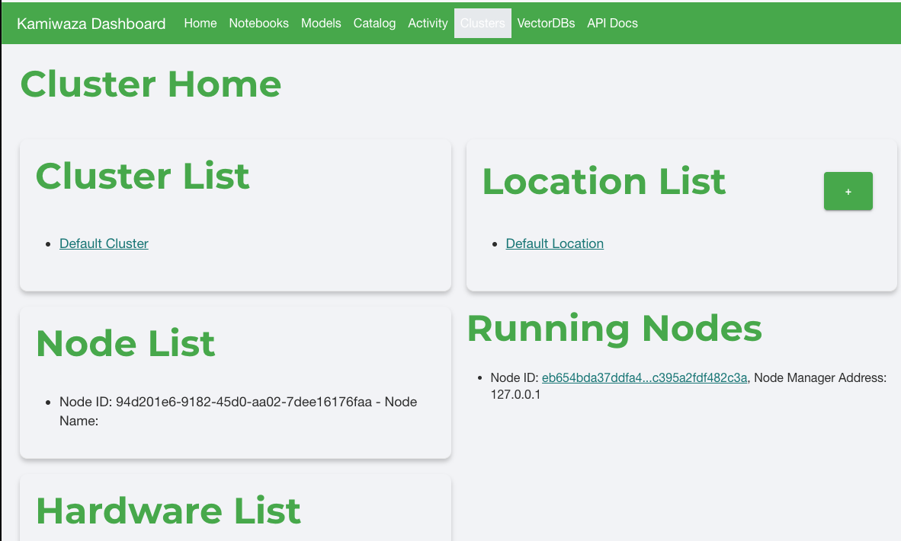
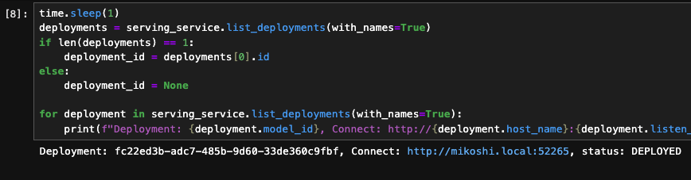
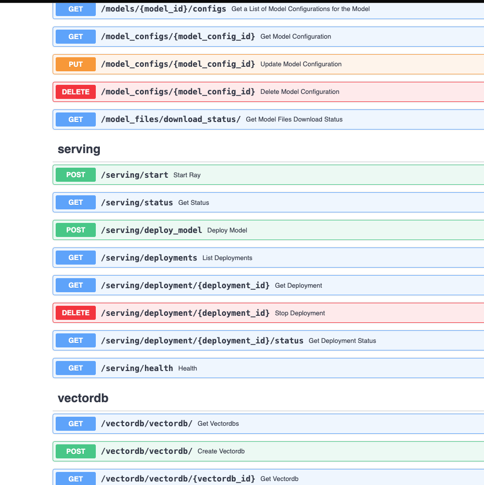
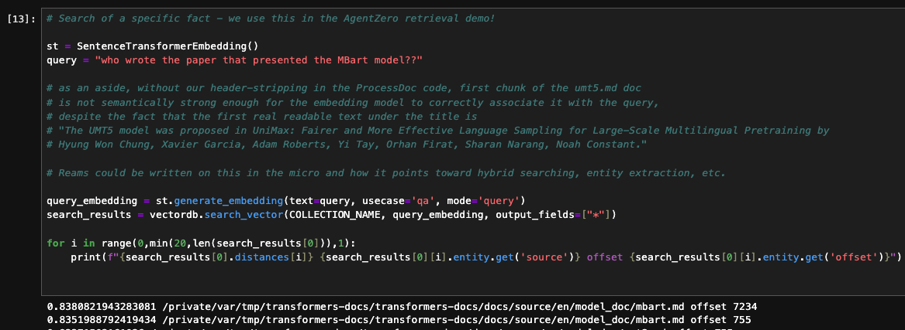
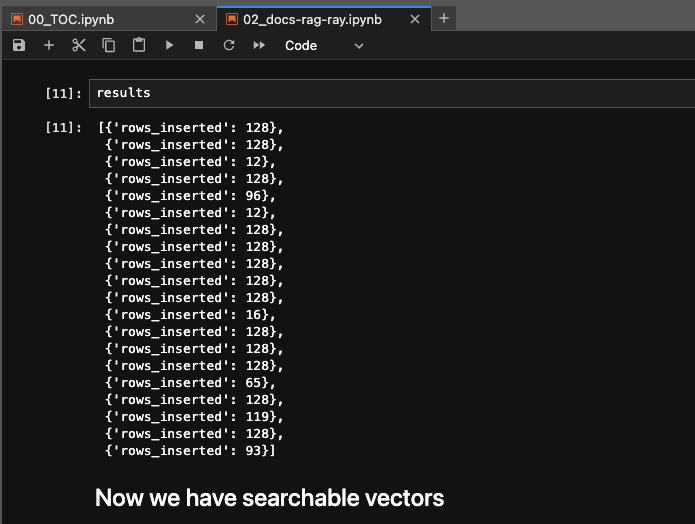
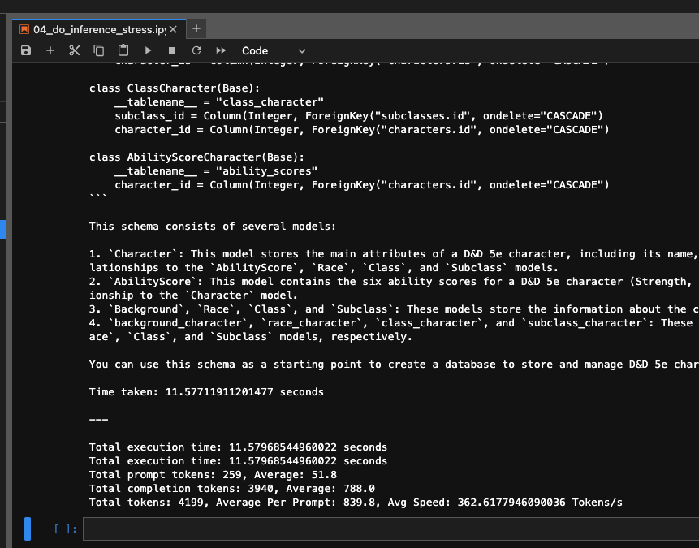

# Kamiwaza Community Edition Showcase

Kamiwaza is an powerful GenAI stack that enables enterprise AI with its Distributed Data Engine and Inference Mesh. The community edition comes packed with a range of powerful features for AI developers.

## API-Accessible Model Repository

Kamiwaza provides a local model repository that is fully accessible via API. This allows you to easily build applications around models and manage model deployments. The model page provides an intuitive interface to browse and interact with available models:

## Powerful Data Catalog 

The built-in data catalog powers data ingestion from files or object storage. It has handy features like automatic credential management. Datasets can be easily viewed and managed:

## Scalable Cluster Management

Kamiwaza provides tools to deploy and manage multi-node clusters; develop locally, but deploy at scale.

## Flexible Model Deployment Options

Models can be deployed with just a few clicks in the UI, or programmatically via code and REST APIs. Deployed models are API-accessible, allowing you to integrate apps. See (AgentZero, a Chat and Agent app for LLMs)[https://github.com/kamiwaza-ai/agentzero], open-sourced from Kamiwaza, which integrates Kamiwaza's Model API for model selection, and Kamiwaza's RAG functions to power contextual chat.

## Integrated Vector Database 

Kamiwaza includes ships with (Milvus)[milvus.io] as a vector database, but our middleware abstracts a lot of vector complexity, so you can get started faster. Like most thing in Kamiwaza, if you want to dig deeper, we don't let our abstraction get in your way; our `vectordb.client` is the Milvus client ready for you to tap into.

 

## Scalable Inference 

The platform is built to handle high volume inferencing workloads with optimized model hosting and intelligent load balancing. One of our default notebooks is a stress test!

Overall, Kamiwaza is a powerful platform for building enterprise AI applications. The community edition is library & API compatible with the enterprise version, with the transition to production in mind.